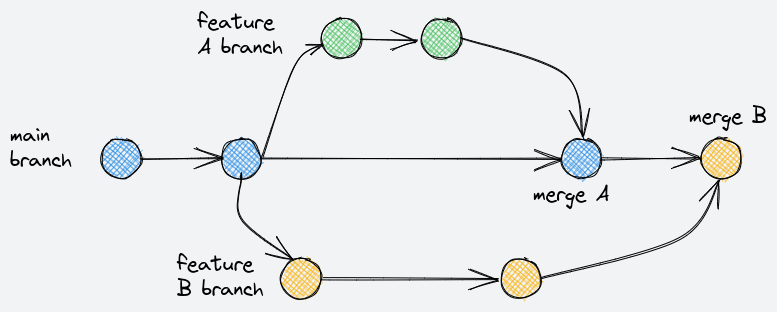

============
Installation
============

There are a number of ways to install this software.

Developer installation
======================

If you want to run it locally on your development system, typically
because you are developing and testing the code, then follow these
instructions.

* install `virtualenv` and install package dependencies:

    The dependencies are specified in the `requirements.txt` file
    at the root of the repository.

    Create a new virtual environment (optional but recommended) and
    run::

        virtualenv venv --python=python3
        . venv/bin/activate
        pip install -r requirments.txt

    The code assumes python version 3.10, see `Dockerfile` for details.

Docker-Compose
==============

The application comes with a `Dockerfile` and `docker-compose.yaml` for building a containerized
version of the application. Docker-compose allows you to start a software stack, containing
this application and a reverse proxy which allows you to replicate the 'production' environment.

.. literalinclude:: ../docker-compose.yaml
   :language: dockerfile

Now run the docker stack::

    docker-compose up --build

Preperations
------------

Now that the stack is running, you must forward some ports on your router to allow
incomming connections to your reverse proxy which will forward the request to the
application. I've made some screenshots on how to perform these steps, but they
might differ for you since every router model has it's own UI/portfowarding options

First perform these three commands while your docker-compose stack is running.
They will show you some of the IPs that should be used in the next steps::

    # DOMAIN
    curl https://ipinfo.io/ip && echo '.nip.io'

    # DOCKER IP
    ip addr show docker0 | egrep -o 'inet [0-9]{1,3}.[0-9]{1,3}.[0-9]{1,3}.[0-9]{1,3}' | sed 's/inet //'

    # INTERNAL IP
    hostname -I | cut -d' ' -f1

Port forwarding
---------------

First login to your router admin panel and forward port 80 -> 80 and 443 -> 443
to your local ip. Be aware that you can change these options, but then you should
also change them in your `docker-compose.yaml` configuration! If you cannot access
the admin panel for your router, ask your network administrator to help you.

Portforward port 80 and 443 in your router:

Accessing the Nginx Proxy Manager 
---------------------------------

Now browse to `localhost:81 <localhost:81>`_ and login using the following credentials::

    Username: admin@example.com
    Password: changeme

You must change these credentials once you log in the first time.

Setting up the proxy host in Nginx Proxy Manager
------------------------------------------------

Now go to `Proxy Hosts <localhost:81/nginx/proxy>`_ and create a new proxy host with the
settings from these screenshots:

Click save, and if it does not throw any errors, it should work. Your application should Now
be accessible via your external IP + nip.io (see DOMAIN command). If the SSL certificate can not
be provisioned due to quotas being exceeded, try to leverage another wildcard DNS service.

Create Fitbit app credentials and updating the docker environment file
----------------------------------------------------------------------

Now set up a new cloud project for development, a personal Fitbit API app and update your environment
variables.

To deploy the container in a runtime, the environment variables defined in
`.env-docker` must be defined in the runtime environment for the container.
For example, running the docker stack on the commandline will work if
you create an `.env-docker` file such as::

.. literalinclude:: ../.env-example

The base64 encoded application credentials can be determined by creating
a service account with sufficient priviliges, downloading the json file, and::

    cat service-account.json | base64 -w 0

The `-w` option ensures no line wrapping that can add characters to the string.

Bitbucket CI
============

The ci pipeline is defined in `bitbucket-pipelines.yml` and includes stages for building,
the documentation and testing. Deployment will be handled by Cloud Build which can watch
this repository.

To develop code, first create a branch off of the main branch
to do and test the changes. In this picture, two independent changes are being
make in two seperate feature branches, `A` and `B`. When `A` is complete it,
a merge request is made to the main branch. At that point, the pipeline builds
and deploys the application in a staging area. The application can be accessed
and tested. If approved by the merge admin, then the changes are merged into the
main branch.

Similarly, the `B` feature branch is developed and tested in a staging area, before
being merged into the main branch.

When merging into the main branch, the application is packaged and deployed in
the production environment.
